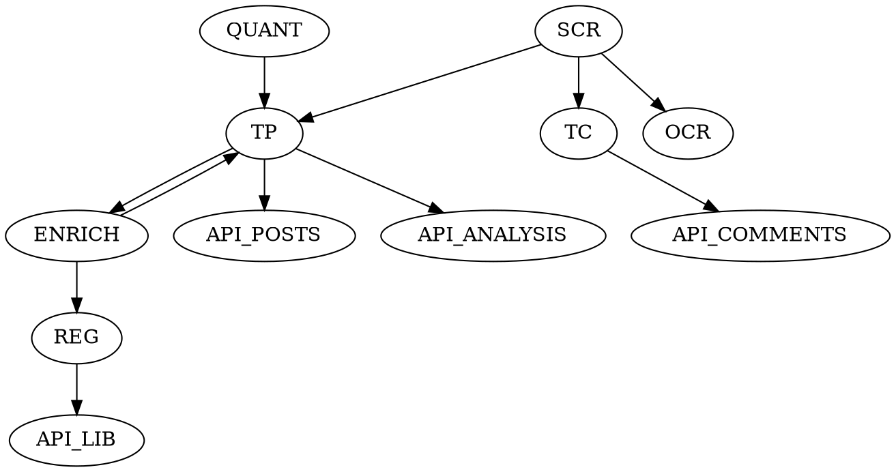

### IO Circuit Map v1 (DiscourseLens_V5)

All references are derived from current repo code. Paths cited inline.

### PORT TABLE (Ingress/Egress)
| Port_ID | Type | Location | Payload (I/O) | SoT/Cache | Failure Mode |
| --- | --- | --- | --- | --- | --- |
| P01 | Ingress | webapp/main.py `/api/run/{pipeline}` | JSON (A: url, B: keyword, C: threshold) | N/A | No job kicked off |
| P02 | Ingress | pipelines/core.py `run_pipeline`, `run_pipelines` | Job context -> crawler/post data | N/A | No post saved |
| P03 | Ingress | scraper/fetcher.py, scraper/parser.py | Threads HTML → post_text, images, comments | Raw SoT | Posts not captured |
| P04 | Ingress | analysis/vision_gate.py + analysis/vision_worker_two_stage.py | VisionGate → Two-Stage Gemini (V1 classify, optional V2 extract) | vision_* + images enrich | Vision skipped/enrich missing |
| P05 | Ingress | analysis/quant_engine.py `perform_structure_mapping` | comments → clusters/quant | Quant SoT | No clustering/quant |
| P06 | Ingress | analysis/analyst.py `generate_commercial_report` | post row + quant → analysis_json/full_report | Cache | analysis_json missing |
| P07 | Ingress | analysis/phenomenon_enricher.py `submit` | analysis_json + fingerprint → phenomenon_id/status/case_id | Identity SoT | Phenomenon columns null |
| P08 | Egress | database/store.py `save_thread` | threads_posts insert + threads_comments upsert | SoT | Post not saved; comments not written |
| P08b | Egress | database/store.py `update_vision_meta` | threads_posts vision_* + images patch | SoT | Vision metadata not persisted |
| P09 | Egress | analysis/phenomenon_enricher.py `_patch_analysis` | threads_posts.phenomenon_* + registry upsert | SoT | Registry/columns stale |
| P10 | Egress | webapp/main.py `/api/posts` | Feed list with phenomenon meta | Cache (DB-first) | UI list missing fields |
| P11 | Egress | webapp/main.py `/api/analysis-json/{id}` | analysis_json + phenomenon envelope | Cache + Identity | Narrative detail fails |
| P12 | Egress | webapp/main.py `/api/library/phenomena` | registry rows + counts | SoT | Library empty |
| P13 | Egress | webapp/main.py `/api/comments/by-post/{id}` | comments list | SoT | Comments browse empty |
| P14 | Egress | webapp/main.py `/api/comments/search` | comment search results | SoT | Search empty |
| P15 | Ingress | database/backfill_*.py scripts | Backfill posts/phenomena/comments | SoT repair | Data not repaired |

### WIRE LIST (From → To)
| Wire_ID | From | To | Transform | Storage Touchpoints | Identities |
| --- | --- | --- | --- | --- | --- |
| W01 | P03 Scraper | threads_posts insert (P08) | Normalize text/snippet; pack metrics/images/raw_comments | threads_posts (post_text, metrics, raw_comments, images) | post_id (DB PK), comment user text |
| W02 | raw_comments | threads_comments upsert (P08) | Normalize list, prefer source_comment_id; fallback hash; set captured_at | threads_comments (id, post_id, text, author_handle/id, like_count, created_at, captured_at, raw_json) | source_comment_id/fallback, post_id |
| W03 | Vision (P04) | analysis pipeline | VisionGate score → V1 classify; optional V2 extract; enrich images + vision_* columns | threads_posts.vision_* + images (via update_vision_meta) | n/a |
| W04 | Quant (P05) | analyst (P06) | Cluster assignments, quant summary | cluster_summary/quant_summary in threads_posts | cluster_key, comment_id |
| W05 | Analyst (P06) | threads_posts analysis write | Build AnalysisV4; validate; add meta | threads_posts.analysis_json, full_report, analysis_* flags | post_id |
| W06 | Analyst → Enricher (P07) | phenomenon patch | Fingerprint → uuid5 + vector match | threads_posts.phenomenon_*; analysis_json.phenomenon | phenomenon_id, case_id |
| W07 | Enricher | Registry | Upsert narrative_phenomena with embedding/placeholder names; increment occurrence | narrative_phenomena (id, status, description, canonical_name, embedding, occurrence_count) | phenomenon_id |
| W08 | Registry/threads_posts | Library API (P12) | Aggregate counts per phenomenon_id | threads_posts, narrative_phenomena | phenomenon_id |
| W09 | threads_comments | Comments API (P13/14) | List/search comments; optional cluster fields | threads_comments (cluster_id/cluster_key) | comment_id, cluster_id |
| W10 | Cluster helper | threads_comment_clusters | Upsert cluster rows + assignments (future hook) | threads_comment_clusters; threads_comments.cluster_id/key | cluster_id = f"{post_id}::c{key}" |

### Mermaid Diagrams

#### A) System Overview
```mermaid
flowchart TD
  subgraph L0 Raw
    SCR[scraper/parser] --> TP[threads_posts]
    SCR --> TC[threads_comments]
    OCR[VisionGate + Two-Stage Vision] --> TP
  end
  subgraph L0.5 Quant
    QUANT[quant_engine perform_structure_mapping] --> TP
  end
  subgraph L1 Analyst
    ANALYST[analyst.generate_commercial_report] --> TP
  end
  subgraph L4 Identity/Registry
    ENRICH[phenomenon_enricher submit] --> TP
    ENRICH --> REG[narrative_phenomena]
  end
  subgraph Serving
    API_POSTS[/api/posts] --> UI_ARCHIVE[ArchivePage/PostSelector]
    API_ANALYSIS[/api/analysis-json/{id}] --> UI_NARR[NarrativeDetailPage]
    API_LIB[/api/library/phenomena] --> UI_LIB[Library UI]
    API_COMMENTS[/api/comments/*] --> UI_COMMENTS[Comments consumers]
  end

  TP --> ENRICH
  TP --> API_POSTS
  TP --> API_ANALYSIS
  REG --> API_LIB
  TC --> API_COMMENTS
```

#### B) Pipeline A Dataflow
```mermaid
flowchart LR
  RUN[/api/run/a] --> JOB[JOBS in webapp/main.py]
  JOB --> PIPE[pipelines/core.py run_pipeline]
  PIPE --> SCR[scraper/fetcher+parser]
  SCR --> TP[threads_posts insert]
  SCR --> TC[threads_comments upsert]
  SCR --> OCR[VisionGate + Two-Stage Vision]
  TP --> QUANT[quant_engine]
  QUANT --> ANALYST[analyst.generate_commercial_report]
  ANALYST --> TP
  TP --> ENRICH[phenomenon_enricher hybrid match/mint]
  ENRICH --> TP
  ENRICH --> REG[narrative_phenomena]
  TP --> API_ANALYSIS[/api/analysis-json/{id}]
  TP --> API_POSTS[/api/posts]

  subgraph Pipeline B (Discovery/Orchestrator)
    DISC[discover_thread_urls keyword feed] --> DEDUPE[dedupe + reprocess policy]
    DEDUPE -->|invoke run_pipeline for each URL| PIPE
  end
```

#### Optional DOT (overview)


### Legend
- Signals (IDs): post_id (threads_posts PK), source_comment_id (native), comment_id (fallback hash), cluster_id (post_id::c<key>), phenomenon_id (uuid), case_id (sha256 fingerprint), analysis_build_id (uuid), job_id.
- Buses: comments bus (threads_comments), phenomenon bus (threads_posts.phenomenon_* + registry), analysis cache bus (analysis_json).
- Clock: created_at (platform), captured_at (ingest), inserted_at/updated_at (DB defaults), updated_at registry.
- Comment identity (CDX-061): threads_comments.id uses native Threads comment id when present; source_comment_id mirrors native id; fallback id = sha256(post_id:author_handle:normalized_text); assignments are update-only.

### Comment Cluster SoT (CDX-060)
- Persistence: `threads_comment_clusters` (id = `post_id::c<cluster_key>`, label/summary/size/keywords/top_comment_ids/centroid_embedding_384) + `threads_comments.cluster_id/cluster_key/cluster_label`.
- Writer: Quant Engine immediately after clustering (Layer 0.5). `analysis_json` keeps display cache only (may add tiny `clusters_ref` meta).
- Joins: `select c.author_handle, c.like_count, c.text, k.cluster_key, k.label from threads_comments c join threads_comment_clusters k on c.cluster_id=k.id where c.post_id=<POST_ID> order by c.like_count desc limit 20;`

### Verification Checklist
- Migrations applied:
  - `2025-threads-comments.sql`, `2025-threads-comment-clusters.sql`, `2025-phenomenon-registry.sql`, `2025-phenomenon-registry-increment.sql`.
- SQL probes:
  - `select post_id, count(*) from threads_comments group by post_id order by count desc limit 5;`
  - `select post_id, count(*) from threads_comment_clusters group by post_id order by count desc limit 5;`
  - `select phenomenon_id, phenomenon_status from threads_posts limit 5;`
  - `select id, status, occurrence_count from narrative_phenomena order by created_at desc limit 5;`
- API probes:
  - `curl -s http://127.0.0.1:8000/api/posts | jq '.[0]|{id,phenomenon_id,phenomenon_status}'`
  - `curl -s http://127.0.0.1:8000/api/analysis-json/<post_id> | jq '{phenomenon: .phenomenon}'`
  - `curl -s http://127.0.0.1:8000/api/library/phenomena | jq 'length'`
  - `curl -s http://127.0.0.1:8000/api/comments/by-post/<post_id>?limit=3 | jq '{post_id,total}'`
  - `curl -s http://127.0.0.1:8000/api/debug/phenomenon/match/<post_id> | jq '{post_id, candidates: .candidates[:3]}'`
- Smoke order:
  1) Apply migrations.
  2) Run Pipeline A on a Threads URL.
  3) Verify posts/comments/phenomena via SQL/APIs above.
